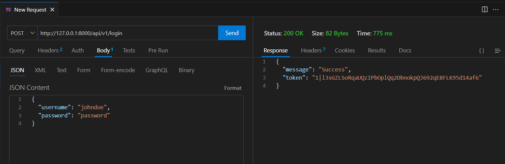

# Laravel REST API demonstration - with sanctum
### On this branch, I use Laravel's preferred way of API authentication

[Sanctum Documentation](https://laravel.com/docs/11.x/sanctum)

For a custom solution, switch to [custom-token](https://github.com/InterMaus1154/laravel-api-demonstration/tree/custom-token) branch

# Description
This is a Laravel API demonstration created as an example for the WorldSkills Web Development Competition. It shows the basic usages of an API, including authentication, pulling data, modifying data.

## What is an API?
An API (Application Programming Interface) allows different software systems to talk to each other. In this case, the Laravel backend exposes data (like user info, products) through an API that a frontend (built with JavaScript, React, etc.) can access and display.

Usually, each request (when the user hits a URL, that's a request, for example `GET api/v1/products` to display a list of products) returns a response in JSON. (Hopefully no need to explain what JSON is.)\
Example output when you hit the `http://127.0.0.1:8000/api/v1/products` in this demo:
```json
[
    {
        "productId": 1,
        "productName": "Saepe dolores excepturi optio consequatur ut dolorem et esse. Doloremque tempora omnis dolore dignissimos. Hic maiores officia eaque ea ullam est suscipit.",
        "category": "Furniture",
        "productPrice": "£456.30",
        "productStock": 93,
        "uploadedAt": "08/05/2025",
        "uploadedBy": {
            "userId": 2,
            "username": "Alysa Wehner",
            "email": "vonrueden.doris@example.net",
            "registeredAt": "08/05/2025"
        }
    },
    {
        "productId": 3,
        "productName": "Occaecati voluptatem incidunt vero et voluptas. Perspiciatis nisi eius ut alias. Nostrum sed aut minima magni corporis voluptatum ab.",
        "category": "Music & Instruments",
        "productPrice": "£442.00",
        "productStock": 54,
        "uploadedAt": "08/05/2025",
        "uploadedBy": {
            "userId": 2,
            "username": "Alysa Wehner",
            "email": "vonrueden.doris@example.net",
            "registeredAt": "08/05/2025"
        }
    }
]
```

Sometimes you want to send data to the server, for example for authentication or to upload a new product. In that case, you use `POST` request, because you can include a request body. In `GET` requests, you cannot have a request body(which is untrue, you can, but it is 99% never used), only query parameters, but they are for different purpose.\
A request body is also sent in a form of JSON.
Example login (picture taken from VSC Thunder Client, which is a VS Code plugin used to interact with API endpoints):

The server returns a 200 success response, and a token.
That token needs to be sent with every further request, that requires a logged-in user.\
The token is sent in the `Authorization` header as a `Bearer` token.
So:
`Authorization: Bearer {token}`.\
To sum up, APIs are a powerful way that allows client applications to communicate with the database. Client-side apps never go to the database directly, as that would be insecure, therefore APIs provide a conventional way to get and send data.

## What this repo includes?

All routes can be found in the [api.php](routes/api.php).

### Authentication
- `POST` user registration
- `POST` user login
- `POST` user logout
- user authentication via bearer token

### Products
- `GET` all (non-hidden) products
- `GET` specific product by ID
- `PATCH` mark a product as hidden (requires user login)
- `POST` create a new product (requires user login)
- `GET` products belonging to logged-in user (requires user login)
- `GET` products belong to a specific user

### Other
- `GET` test endpoint to test if API is running and reachable

## Recommended further resources

[Install Laravel api in Laravel 11+](https://artisan.page/11.x/installapi)\
[Laravel sanctum](https://laravel.com/docs/12.x/sanctum)\
[Laravel API resource classes](https://laravel.com/docs/12.x/eloquent-resources)
